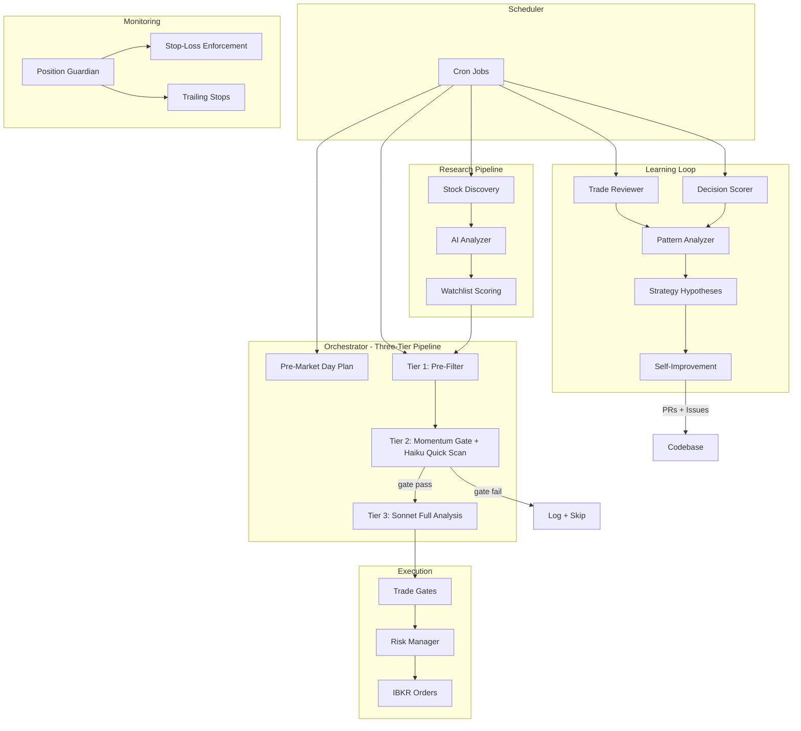

# Agent Briefing

> Read this after `AGENTS.md`. This document covers project status, sequencing, and what to work on next. `AGENTS.md` covers stack, commands, and deployment.

---

## What This Project Is

An automated trading agent for an IBKR UK Stocks & Shares ISA. It discovers stocks via screening and news, researches them with AI analysis, and executes trades through a three-tier decision pipeline with mandatory risk gates. It reviews its own decisions, identifies patterns, proposes hypotheses, and modifies its own code weekly. Currently paper trading; the goal is to graduate to real money. See [platform-goals.md](./platform-goals.md) for the full list of stated goals.

Governing documents:
- [implementation-plan.md](./implementation-plan.md) — step-by-step build order for all phases
- [strategy-framework.md](./strategy-framework.md) — KPI framework, measurement windows, rollout discipline
- [agentic-process-audit.md](./agentic-process-audit.md) — full system audit that produced the implementation plan

---

## Architecture

Key modules:
- **`src/agent/orchestrator.ts`** — main control flow, market phase management, three-tier pipeline
- **`src/agent/planner.ts`** — Claude API execution engine (Haiku quick scan, Sonnet full analysis)
- **`src/agent/tools.ts`** — tool definitions the AI agent can call
- **`src/analysis/indicators.ts`** — technical indicators (SMA, RSI, MACD, ATR, Bollinger Bands)
- **`src/analysis/momentum-gate.ts`** — pre-AI filter based on trend/RSI/volume signals
- **`src/broker/guardian.ts`** — 60-second loop: stop-loss enforcement, price updates, trailing stops
- **`src/risk/manager.ts`** — pre-trade risk checks (exclusions, sizing, sector concentration, volume)
- **`src/research/pipeline.ts`** — stock discovery, deep research, watchlist updates
- **`src/learning/decision-scorer.ts`** — scores HOLD/WATCH/PASS decisions after market close
- **`src/learning/pattern-analyzer.ts`** — weekly pattern analysis, hypothesis management
- **`src/self-improve/monitor.ts`** — weekly self-modification (PRs for allowed files, issues for others)
- **`src/db/schema.ts`** — all Drizzle ORM table definitions

---

## Implementation Status

| Phase | Status | Commit | Notes |
|-------|--------|--------|-------|
| **1: Foundation** | COMPLETE | `51747de` (2026-02-20) | Steps 1.1–1.6 all done. Deployed. |
| **1.2: Profit Optimisation** | NOT DONE | — | Independent of other phases. [Detail doc](./phase1.2-profit-optimisation.md). |
| **1.5: US Stocks** | NOT DONE | — | Was supposed to precede Phase 2. Skipped. [Detail doc](./phase1.5-us-stocks.md). |
| **2: Trading Intelligence** | COMPLETE | `fdb9bce` | Steps 2.1–2.6 all done. Indicators, gate, ATR sizing, trailing stops, prompts. |
| **3: Learning Depth** | COMPLETE | `fdb9bce` | Steps 3.1–3.7 all done. Decision scorer, signal attribution, hypotheses, self-improvement. |
| **4: Autonomy Escalation** | NOT DONE | — | Steps 4.1–4.3 in [implementation-plan.md](./implementation-plan.md). |

### What Phase 1.2 covers (6 steps, ~7 files)
1. Kill sector rotation in screening — replace day-of-week sectors with momentum-based screening
2. Concentrate positions — `MAX_POSITIONS: 10→5`, `MAX_POSITION_PCT: 5→15`, `MIN_CASH_RESERVE_PCT: 20→10`
3. Quality filter in research analyzer — structured signal fields in analysis output
4. Signal-driven watchlist scoring — replace weighted formula with quality/catalyst signals
5. Richer Yahoo fundamentals — add `earningsTrend`, `calendarEvents` modules
6. Reduce paper trading conservatism — lower confidence thresholds for paper mode

### What Phase 1.5 covers (~12 steps, ~20 files)
Makes `exchange` a first-class concept throughout the system:
- Schema: add `exchange` and `currency` columns to watchlist, positions, trades
- Broker: `usStock()` contract builder, exchange-aware `getContract()` dispatcher
- Quotes: exchange-aware symbol formatting in Yahoo/FMP (no `.L` suffix for US)
- Orders: `exchange` field in `TradeRequest`, route to correct contract
- Risk: remove `ISA_LSE_ONLY`/`ISA_GBP_ONLY`, add `ISA_ALLOWED_EXCHANGES`, stamp duty only for LSE
- Screening: new `src/research/sources/us-screener.ts` using FMP native NASDAQ/NYSE
- Reconciliation: extract exchange/currency from IBKR position data

### What Phase 4 covers (3 steps)
1. Rollout ladder — `config/operating-mode.json`, constrained limits for live trading
2. Rollback triggers — categorize rejections (strategy vs infrastructure), auto-revert mode
3. Governance reporting — weekly email with policy changes, impact attribution, rollback events

---

## The Sequencing Problem

Phase 1.5 (US Stocks) was listed as a "reference doc" in the implementation plan header but its steps were never included in the main plan's numbered sequence. It was skipped entirely. Phases 2 and 3 were built assuming LSE-only.

**Impact on completed work:**

- **Phase 2 pure functions are exchange-agnostic.** `computeIndicators()`, `evaluateGate()`, `computeTrailingStopUpdate()`, `calculateStopLoss()`, `getAtrPositionSize()` — all operate on price/bar data regardless of exchange. No rework needed.
- **Integration points need moderate rework.** The orchestrator calls `lseStock()` directly. The guardian fetches quotes assuming LSE. The research pipeline appends `.L` suffixes. Yahoo Finance hardcodes `.L`. These paths need to become exchange-dispatched when Phase 1.5 is implemented.
- **Phase 1.2 is fully independent.** No overlap or dependency with 1.5.
- **Phase 4 is additive.** Depends on all prior phases being stable but doesn't conflict.

---

## Recommended Work Order

1. **Phase 1.2 — Profit Optimisation.** Smaller scope (~6 steps), independent of everything, immediate impact on trading quality. See [phase1.2-profit-optimisation.md](./phase1.2-profit-optimisation.md).
2. **Phase 1.5 — US Stocks.** Larger scope (~12 steps), requires schema migration and touching integration points across the codebase. See [phase1.5-us-stocks.md](./phase1.5-us-stocks.md).
3. **Phase 4 — Autonomy Escalation.** After observation period on 1.2 + 1.5. Steps 4.1–4.3 in [implementation-plan.md](./implementation-plan.md).

---

## Key Files for Upcoming Work

| File | What it does | Touched by |
|------|-------------|------------|
| `src/db/schema.ts` | All table definitions (Drizzle ORM) | 1.5 |
| `src/risk/limits.ts` | Hardcoded safety limits, ISA constraints | 1.2, 1.5 |
| `src/risk/manager.ts` | Pre-trade risk checks, position sizing | 1.5 |
| `src/broker/contracts.ts` | IBKR contract construction (currently LSE-only) | 1.5 |
| `src/broker/market-data.ts` | Quote fetching, historical bars | 1.5 |
| `src/broker/orders.ts` | Order placement (currently no exchange field) | 1.5 |
| `src/broker/account.ts` | Position reconciliation from IBKR | 1.5 |
| `src/broker/guardian.ts` | Position monitoring loop | 1.5 |
| `src/research/sources/lse-screener.ts` | LSE stock screening with sector rotation | 1.2, 1.5 |
| `src/research/sources/yahoo-finance.ts` | Yahoo Finance client (hardcodes `.L` suffix) | 1.2, 1.5 |
| `src/research/analyzer.ts` | AI stock analysis prompt | 1.2 |
| `src/research/watchlist.ts` | Watchlist scoring formula | 1.2 |
| `src/research/pipeline.ts` | Research orchestration | 1.2, 1.5 |
| `src/agent/orchestrator.ts` | Main trading loop | 1.5, 4 |
| `config/momentum-gate.json` | Momentum gate parameters | — |
| `config/operating-mode.json` | (to be created) Operating mode for rollout ladder | 4 |

---

## Development Conventions

- **TDD:** Follow the TDD skill at `.cursor/skills/tdd/SKILL.md`. Red-green-refactor, one test at a time, vertical slicing through the public interface.
- **Commits:** One commit per implementation step. Deploy after each phase.
- **Observation:** Deploy then observe for at least one trading week before starting the next phase.
- **Verification:** Run `bun run typecheck && bun run lint && bun test` after each phase. Production verification checklists are at the bottom of [implementation-plan.md](./implementation-plan.md).
- **Migrations:** `bun run db:generate` then `bun run db:migrate`. Migrations run on deploy with proper env vars.
- **Git:** `git add .` is forbidden. Add files individually.

---

## Chat History

Previous implementation work is documented in agent transcripts. Key sessions:
- [Phase 2+3 implementation](948f0caa-73ae-4c9f-b54f-085279ab1c18) — implemented all of Phase 2 and Phase 3, discovered Phase 1.5 was skipped
